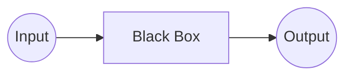
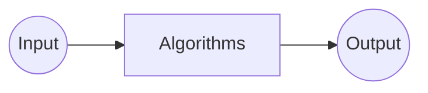
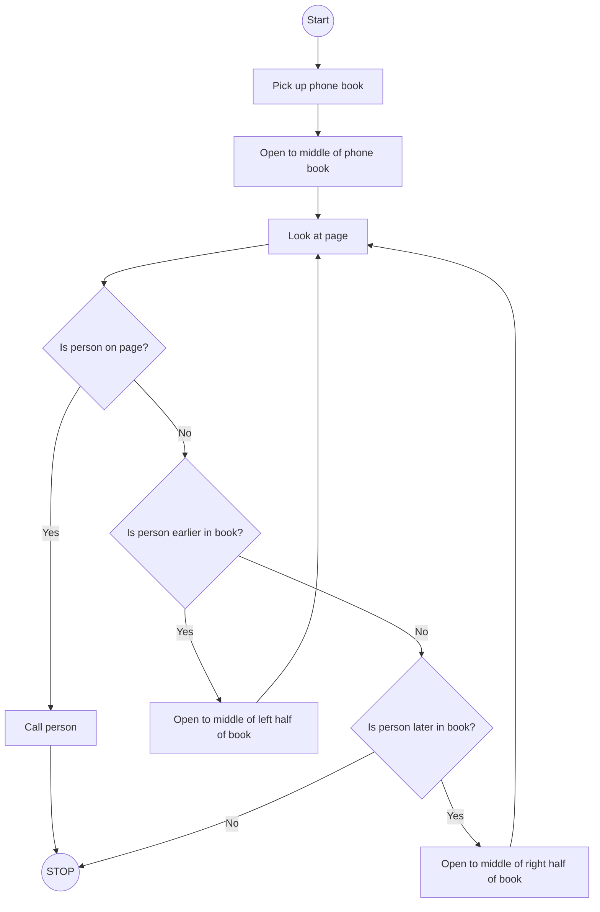

# <center>Introduction To Programming With C</center>

---

# Problem Solving



---

# Number Systems

## Unary

digit = 1

111111


## Binary

digits = 0 and 1

| F1  | F2  | F3  | F4  | F5 = Thumb | Value |
| --- | --- | --- | --- | ---------- | ----- |
| 0   | 0   | 0   | 0   | 0          | 0     |
| 0   | 0   | 0   | 0   | 1          | 1     |
| 0   | 0   | 0   | 1   | 0          | 2     |
| 0   | 0   | 0   | 1   | 1          | 3     |
| ... | ... | ... | ... | ...        | ...   |
| 1   | 1   | 1   | 1   | 1          | 31    |
$(10100)_2 = 1 \times 2^4 + 0 \times 2^3 + 1 \times 2^2 + 0 \times 2^1 + 0 \times 2^0$
$(10100)_2 = 1 \times 16 + 0 \times 8 + 1 \times 4 + 0 \times 2 + 0 \times 1$
$(10100)_2 = (20)_{10}$

## Octal

digits = 0, 1, 2, 3, 4, 5, 6, 7
## Decimal

$123 = 1\times100 + 2 \times 10 + 3 \times 1$
$123 = 1 \times 10^2 + 2 \times 10^1 + 3 \times 10^0$

## Hexadecimal

digits = 0, 1, 2, 3, 4, 5, 6, 7, 8, 9, A, B, C, D, E, F

---

# Data Units

## Basic Units

- **Bit (b):** Smallest unit of data (0 or 1)
- **Byte (B):** 1 Byte = 8 Bits
- Ex. 0010 1101

## Two Measurement Systems

1. **Decimal (Base 10)**
    
    | Unit | Name     | Size in Bytes     |
    | ---- | -------- | ----------------- |
    | KB   | Kilobyte | 1 KB = 1000 bytes |
    | MB   | Megabyte | 1 MB = 1000 KB    |
    | GB   | Gigabyte | 1 GB = 1000 MB    |
    | TB   | Terabyte | 1 TB = 1000 GB    |
    
2. **Binary (Base 2)**
    
    | Unit | Name     | Size in Bytes     |
    | ---- | -------- | ----------------- |
    | KiB   | Kibibyte | 1 KiB = 1024 bytes |
    | MiB   | Mebibyte | 1 MiB = 1024 KiB    |
    | GiB   | Gibibyte | 1 GiB = 1024 MiB    |
    | TiB   | Tebibyte | 1 TiB = 1024 GiB    |

## Bit vs. Byte Units

| Unit | Name     | Size in Bytes         |
| ---- | -------- | --------------------- |
| Kb   | Kilobit  | 1000 bits (125 bytes) |
| KB   | Kilobyte | 1000 bytes            |
| KiB  | Kibibyte | 1024 bytes            |

---

# Representing other things in Computer

## Text

1. **ASCII**

A = (65)<sub>10</sub> = (1000001)<sub>2</sub>

2^8 = 256

2. **Unicode**

## Images

1. **Grayscale**
0
255

2. **Colors**
    - RGBA
    1111 1111 0000 0000 1111 1111
    `#FF00FF`
    - HSL
    - CMY
3. **Transparency**

## Audios

## Videos


---

# Endianness

1. **little-endian**
    LSB at lowest memory address
    0000 0000 | 0000 0000 | 0000 0000
    
    5 = 0000 0000 | 0000 0000 | 0000 0101
    0000 0101 | 0000 0000 | 0000 0000
    
2. **big-endian**
    MSB at lowest memory address
    5 = 0000 0000 | 0000 0000 | 0000 0101
    0000 0000 | 0000 0000 | 0000 0101
---

# Two's Complement

0000 0000 | 0000 0000 | 0000 0101 (normal binary)
1111 1111 | 1111 1111 | 1111 1010 + 1 (one's complement)
1111 1111 | 1111 1111 | 1111 1011 (two's complement)

---

# Algorithms

Steps.
Not only correct bur precise.
Finite.
Remember, computer is not a human.



<iframe width="589" height="331" src="https://www.youtube.com/embed/DSffdCT5Cx4" title="CS50 2018 - Lecture 0 - Phone Book" frameborder="0" allow="accelerometer; autoplay; clipboard-write; encrypted-media; gyroscope; picture-in-picture; web-share" referrerpolicy="strict-origin-when-cross-origin" allowfullscreen></iframe>

<iframe width="589" height="331" src="https://www.youtube.com/embed/okkIyWhN0iQ" title="CS50 2018 - Lecture 1 - Peanut Butter and Jelly" frameborder="0" allow="accelerometer; autoplay; clipboard-write; encrypted-media; gyroscope; picture-in-picture; web-share" referrerpolicy="strict-origin-when-cross-origin" allowfullscreen></iframe>

---

# Pseudocode

```
1     Pick up phone book
2     Open to middle of phone book
3     Look at page
4     If person is on page
5         Call person
6     Else if person is earlier in book
7         Open to Middle of left half of book
8         Go back to line 3
9     Else if person is later in book
10        Open to middle of right half of book
11        Go back to line 3
12    Else
13        Quit
```

---

# Flowchart

