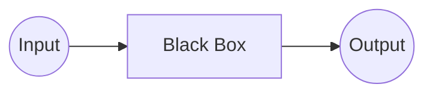
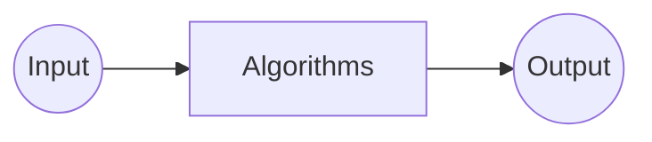
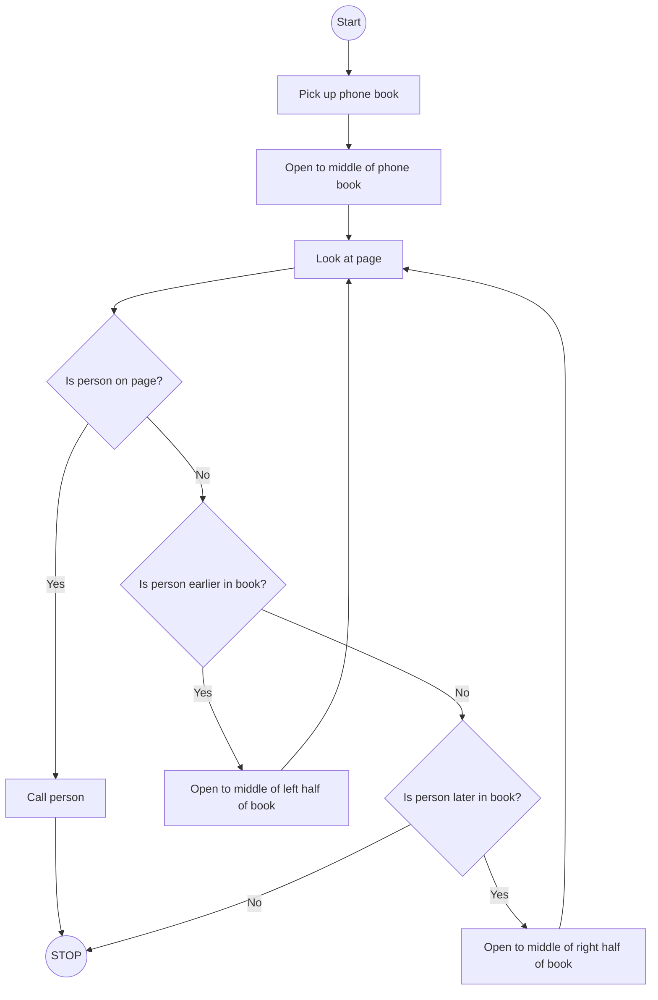

# <center>Introduction To Programming With C</center>

---

# Problem Solving



---

# Number Systems

## Unary

digit = 1

111111


## Binary

digits = 0 and 1

| F1  | F2  | F3  | F4  | F5 = Thumb | Value |
| --- | --- | --- | --- | ---------- | ----- |
| 0   | 0   | 0   | 0   | 0          | 0     |
| 0   | 0   | 0   | 0   | 1          | 1     |
| 0   | 0   | 0   | 1   | 0          | 2     |
| 0   | 0   | 0   | 1   | 1          | 3     |
| ... | ... | ... | ... | ...        | ...   |
| 1   | 1   | 1   | 1   | 1          | 31    |
$(10100)_2 = 1 \times 2^4 + 0 \times 2^3 + 1 \times 2^2 + 0 \times 2^1 + 0 \times 2^0$
$(10100)_2 = 1 \times 16 + 0 \times 8 + 1 \times 4 + 0 \times 2 + 0 \times 1$
$(10100)_2 = (20)_{10}$

## Octal

digits = 0, 1, 2, 3, 4, 5, 6, 7
## Decimal

$123 = 1\times100 + 2 \times 10 + 3 \times 1$
$123 = 1 \times 10^2 + 2 \times 10^1 + 3 \times 10^0$

## Hexadecimal

digits = 0, 1, 2, 3, 4, 5, 6, 7, 8, 9, A, B, C, D, E, F

---

# Data Units

## Basic Units

- **Bit (b):** Smallest unit of data (0 or 1)
- **Byte (B):** 1 Byte = 8 Bits
- Ex. 0010 1101

## Two Measurement Systems

1. **Decimal (Base 10)**
    
    | Unit | Name     | Size in Bytes     |
    | ---- | -------- | ----------------- |
    | KB   | Kilobyte | 1 KB = 1000 bytes |
    | MB   | Megabyte | 1 MB = 1000 KB    |
    | GB   | Gigabyte | 1 GB = 1000 MB    |
    | TB   | Terabyte | 1 TB = 1000 GB    |
    
2. **Binary (Base 2)**
    
    | Unit | Name     | Size in Bytes     |
    | ---- | -------- | ----------------- |
    | KiB   | Kibibyte | 1 KiB = 1024 bytes |
    | MiB   | Mebibyte | 1 MiB = 1024 KiB    |
    | GiB   | Gibibyte | 1 GiB = 1024 MiB    |
    | TiB   | Tebibyte | 1 TiB = 1024 GiB    |

## Bit vs. Byte Units

| Unit | Name     | Size in Bytes         |
| ---- | -------- | --------------------- |
| Kb   | Kilobit  | 1000 bits (125 bytes) |
| KB   | Kilobyte | 1000 bytes            |
| KiB  | Kibibyte | 1024 bytes            |

---

# Representing other things in Computer

## Text

1. **ASCII**

A = (65)<sub>10</sub> = (1000001)<sub>2</sub>

2^8 = 256

2. **Unicode**

## Images

1. **Grayscale**
0
255

2. **Colors**
    - RGBA
    1111 1111 0000 0000 1111 1111
    `#FF00FF`
    - HSL
    - CMY
3. **Transparency**

## Audios

## Videos


---

# Endianness

1. **little-endian**
    LSB at lowest memory address
    0000 0000 | 0000 0000 | 0000 0000
    
    5 = 0000 0000 | 0000 0000 | 0000 0101
    0000 0101 | 0000 0000 | 0000 0000
    
2. **big-endian**
    MSB at lowest memory address
    5 = 0000 0000 | 0000 0000 | 0000 0101
    0000 0000 | 0000 0000 | 0000 0101
---

# Two's Complement

0000 0000 | 0000 0000 | 0000 0101 (normal binary)
1111 1111 | 1111 1111 | 1111 1010 + 1 (one's complement)
1111 1111 | 1111 1111 | 1111 1011 (two's complement)

---

# Algorithms

Steps.
Not only correct bur precise.
Finite.
Remember, computer is not a human.



<iframe width="589" height="331" src="https://www.youtube.com/embed/DSffdCT5Cx4" title="CS50 2018 - Lecture 0 - Phone Book" frameborder="0" allow="accelerometer; autoplay; clipboard-write; encrypted-media; gyroscope; picture-in-picture; web-share" referrerpolicy="strict-origin-when-cross-origin" allowfullscreen></iframe>

<iframe width="589" height="331" src="https://www.youtube.com/embed/okkIyWhN0iQ" title="CS50 2018 - Lecture 1 - Peanut Butter and Jelly" frameborder="0" allow="accelerometer; autoplay; clipboard-write; encrypted-media; gyroscope; picture-in-picture; web-share" referrerpolicy="strict-origin-when-cross-origin" allowfullscreen></iframe>

---

# Pseudocode

```
1     Pick up phone book
2     Open to middle of phone book
3     Look at page
4     If person is on page
5         Call person
6     Else if person is earlier in book
7         Open to Middle of left half of book
8         Go back to line 3
9     Else if person is later in book
10        Open to middle of right half of book
11        Go back to line 3
12    Else
13        Quit
```

---

# Flowchart



---

# C Language

- Memory and Its addresses
    
| `0x1117`  | `0x1118`  | `0x1119`  | `0x111A`  | `0x111B`  | `0x111C`  |
| :-------: | :-------: | :-------: | :-------: | :-------: | :-------: |
| 0000 0001 | 0000 0010 | 0000 0011 | 0000 0100 | 0000 0101 | 0000 0110 |

- Keywords

<table>
    <tr>
        <td style="text-align: center"><code>auto</code></td>
        <td style="text-align: center"><code>break</code></td>
        <td style="text-align: center"><code>case</code></td>
        <td style="text-align: center"><code>char</code></td>
        <td style="text-align: center"><code>const</code></td>
        <td style="text-align: center"><code>continue</code></td>
    </tr>
    <tr>
        <td style="text-align: center"><code>default</code></td>
        <td style="text-align: center"><code>do</code></td>
        <td style="text-align: center"><code>double</code></td>
        <td style="text-align: center"><code>else</code></td>
        <td style="text-align: center"><code>enum</code></td>
        <td style="text-align: center"><code>extern</code></td>
    </tr>
    <tr>
        <td style="text-align: center"><code>float</code></td>
        <td style="text-align: center"><code>for</code></td>
        <td style="text-align: center"><code>goto</code></td>
        <td style="text-align: center"><code>if</code></td>
        <td style="text-align: center"><code>int</code></td>
        <td style="text-align: center"><code>long</code></td>
    </tr>
    <tr>
        <td style="text-align: center"><code>register</code></td>
        <td style="text-align: center"><code>return</code></td>
        <td style="text-align: center"><code>short</code></td>
        <td style="text-align: center"><code>signed</code></td>
        <td style="text-align: center"><code>sizeof</code></td>
        <td style="text-align: center"><code>static</code></td>
    </tr>
    <tr>
        <td style="text-align: center"><code>struct</code></td>
        <td style="text-align: center"><code>switch</code></td>
        <td style="text-align: center"><code>typedef</code></td>
        <td style="text-align: center"><code>union</code></td>
        <td style="text-align: center"><code>unsigned</code></td>
        <td style="text-align: center"><code>void</code></td>
    </tr>
    <tr>
        <td style="text-align: center"><code>volatile</code></td>
        <td style="text-align: center"><code>while</code></td>
        <td style="text-align: center"><code>inline</code></td>
        <td style="text-align: center"><code>restrict</code></td>
        <td style="text-align: center"></td>
        <td style="text-align: center"></td>
    </tr>
</table>

- Data Types
    - `int`: ways of writing an int
    - `float`
    - `long`
    - `double`
- Operators
    - Arithmetic: `+`, `-`, `*`, `/`, `%`
    - Relational: `==`, `!=`, `>`, `<`, `>=`, `<=`
    - Logical: `&&`, `||`, `!`
    - Assignment: `=`, `+=`, `-=`, etc.
    - Bitwise: `&`, `|`, `^`, `~`, `<<`, `>>`
        a = 5: 0000 0101
        b = 6: 0000 0110
        a & b = (0000 0101) & (0000 0110) = (0000 0100) = 4
        a | b = (0000 0101) | (0000 0110) = (0000 0111) = 7
        a ^ b = (0000 0101) ^ (0000 0110) = (0000 0011) = 3
        ~a = ~(0000 0101) = (1111 1010)
        a << 2 = (0000 0101) << 2 = (0001 0100)
        a >> 2 = (0000 0101) >> 2 = (0000 0001)
        a & 1 = (0000 0101) & (0000 0001) = (0000 0001) = 1 (odd)
        b & 1 = (0000 0110) & (0000 0001) = (0000 0000) = 0 (even)
        
        a ^ b = k
        a ^ k = b
        b ^ k = a
        
    - Ternary: `?:`
    - `sizeof`
- Variables
    Rules for making identifiers
- Control Flow
    - Conditionals: `if`, `else`, `else if`, `switch`
    - Loops: `for`, `while`, `do-while`
    - `break`, `continue`, `goto`
- Functions
    - Declaration vs Definition
    - Parameters and return types
    - Call by value vs call by reference
    - Command line arguments
    - Recursion
    - Types of Variables:
        - Based on storage class
            | Name        | keyword    | Scope        | Lifetime       | Default value         |
            | ---------     | ---------- | ------------ | -------------- | --------------------- |
            | Automatic | `auto`     | Local        | Function/block | Garbage               |
            | Static        | `static`   | Local/Global | Entire program | 0                     |
            | External  | `extern`   | Global       | Entire program | Depends on definition |
            | Register  | `register` | Local        | Function/block | Garbage               |
    - Static Function
    - Linkage of different types of variables and functions
- Array and Strings
    - Single and multi-dimensional arrays
    - Strings
    - `<string.h>` library functions
        - `strlen(str)`
        - `strcpy(dest, src)`
        - `strncpy(dest, src, n)`
        - `strcat(dest, src)`
        - `strncat(dest, src, n)`
        - `strcmp(str1, str2)`
        - `strncmp(str1, str2, n)`
        - `strchr(str, ch)`
        - `strstr(str, substr)`
        - `memset(ptr, ch, n)`
        - `memcpy(dest, src, n)`
        - `memcmp(ptr1, ptr2, n)`
- Pointers
    - What is a pointer
    - `&` and `*` operators
    - Pointer arithmetic
    - Pointers and arrays
    - Types of Pointers
        - null pointer - Points to NULL
        - wild pointer - Uninitialized pointer
        - void pointer - generic pointer `void *`
        - dangling pointer - points to freed memory location
    - Pointer to pointer
    - Function Pointers
- Structs, Unions, Enums, Typedef
    - Self referential structure
- Dynamic Memory Management
    - `malloc`, `calloc`, `realloc`, `free`
    - Memory layout of C program
        
- File I/O
    - Types of files: text and binary files
    - File stream
    - 
        ```c
        FILE *fopen(const char *filename, const char *mode);
        int fclose(FILE *stream);
        
        // stdin, stdout, stderr, EOF
        
        int fprintf(FILE *stream, const char *format, ...);
        int fscanf(FILE *stream, const char *format, ...);
        
        int feof(FILE *stream);
        long ftell(FILE *stream);
        int fseek(FILE *stream, long offset, int origin);
        // SEEK_SET, SEEK_CUR, SEEK_END
    
        int fflush(FILE *stream);
    
        size_t fread(void *buffer, size_t size, size_t count, FILE *stream);
        size_t fwrite(const void* buffer, size_t size, size_t count, FILE* stream);
        // size_t is an unsigned integer type and is guaranteed to have more than or equal to 16 bits
        
        ```
- Variadic function (Variable arguments functions)
    - `<stdarg.h>` standard library
    - `va_list`, `va_start`, `va_arg`, `va_end`
- Preprocessor Directives & Macros
    ```c
    #include 
    
    #define 
    
    #if
    #ifdef
    #ifndef
    #elif
    #elifdef
    #elifndef
    #else
    #endif
    
    #pragma

    ```
    - Stringification (`#`)
    - Token Pasting (`##`)
    - `_WIN32`, `_WIN64`, `__linux__`, `__APPLE__`, `__unix__`, etc.
- Compilation Process
    - `Preprocessing -> Compilation -> Assembly -> Linking`
    - Use of gcc options
        - `-o`: output file name
        - `-E`: stop after preprocessing (`.i`)
        - `-S`: stop after compilation (`.s`)
        - `-c`: stop after compiling to object file no linking (`.c`)
        - `-save-temps`
- Modular Programming
    - Splitting code into `.c` and `.h` files
    - Header guards
    - Circular Includes
- C standard library
    - `stdbool.h`
        ```c
        bool
        true
        false
        ```
    - `time.h`
        - **epoch:** Jan 1 1970 00:00 UTC
        ```c
        time_t; // Type capable of representing times (seconds since epoch
        time_t time(time_t *arg);
        
        clock_t; // Type capable of representing the processor time
        
        // Approx processor time used by the process since its invocation
        clock_t clock(void);
        
        CLOCK_PER_SEC

        double difftime(time_t time_end, time_t time_beg); // diff in seconds
        ```
    
    - `stdio.h`
        ```c
        int sscanf(const char *buffer, const char *format, ...);
        int sprintf(char *buffer, const char *format, ...);

        int remove(const char* fname);
        int rename(const char* old_filename, const char* new_filename);

        ```
    - `stdlib.h`
        ```c
        int atexit(void (*func)(void));
        int system(const char *command);
        char *getenv(const char *name);
        
        int rand(); // 0 to RAND_MAX
        void srand(unsigned int seed);
        RAND_MAX // Guaranteed to be greater than 32767
        
        double atof(const char *str);
        int atoi(const char *str);
        ```
    - `ctype.h`
        ```c
        int isalnum(int ch);
        int isalpha(int ch);
        int islower(int ch);
        int isupper(int ch);
        int isdigit(int ch);
        int isspace(int ch); // Space, \f, \n, \r, \t, \v
        int isblank(int ch); // Space, \t
        int ispunct(int ch); // !"#$%&'()*+,-./:<;=?>@[\]^_`{|}~
        
        int tolower(int ch);
        int toupper(int ch);
        ```
    - `string.h`
        ```c
        void *memset(void *dest, int ch, size_t count);
        void *memcpy(void *dest, const void *src, size_t count);
        ```
    - `math.h`
    - `limits.h` - Limits of integer types
        ```c
        <type>_WIDTH
        <type>_MIN
        <type>_MAX
        ```
    - `stdint.h`
        ```c
        int8_t
        int16_t
        int32_t
        int64_t
        
        uint8_t
        uint16_t
        uint32_t
        uint64_t
        
        <type>_WIDTH
        <type>_MIN
        <type>_MAX
        ```
    - `windows.h` - Windows API
        ```
        Sleep(int milliseconds);
        ```
- Advanced printing
    - ANSI Escape codes
    - Colors
    - Animation


# Build Automation Tool: make

rules: dependencies

## Special Rules

- .PHONY
- .SILENT

## Automatic Variables

```make
# The target of the rule
$@

# The first dependency
$<

# All dependencies
$^

# The stem of a pattern rule: main from main.c
$*

```


---

# References

- [The GNU C Reference Manual](https://www.gnu.org/software/gnu-c-manual/gnu-c-manual.html)
- https://en.cppreference.com/w/c/language.html
- https://c-faq.com
- https://cdecl.org